# **UniPay – Digital Banking & E-Wallet Management Platform**

UniPay is a complete and modern platform designed for managing bank accounts, financial transactions, and internal employee operations. It provides a **modular, secure, and scalable architecture** suitable for modern digital banking solutions.

### Home Page
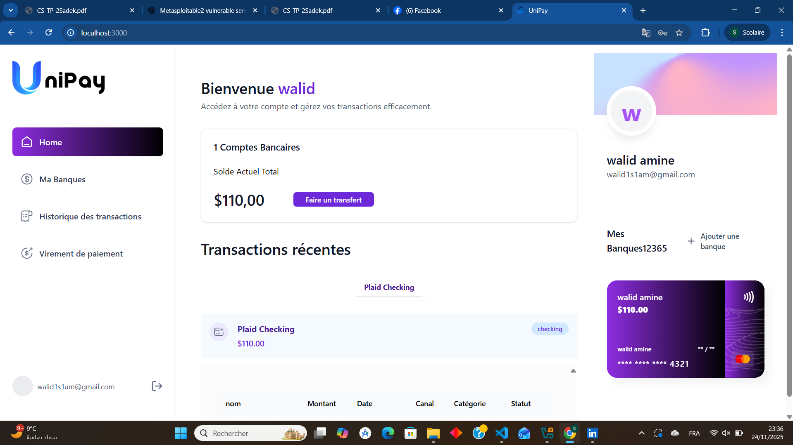
---

## 🎯 **Main Features**

### AUTH
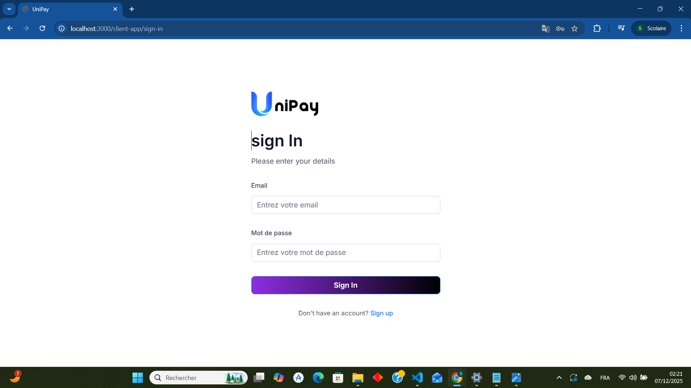
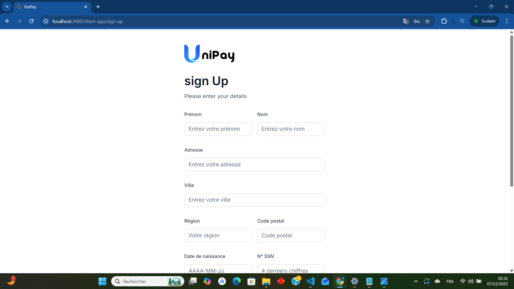

### 🔹 **Client Interface**
- Real-time balance consultation
- ### Mes Banques
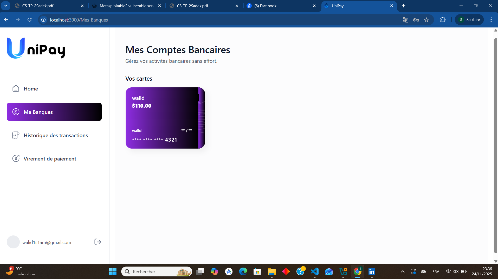
- Multi-account management
- Detailed transaction history
- ### Transactions
- 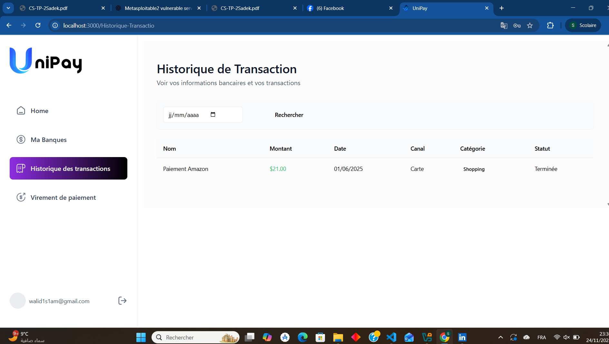
- Internal & inter-bank transfers
- Bank synchronization through **Plaid**
- ### Transfers
 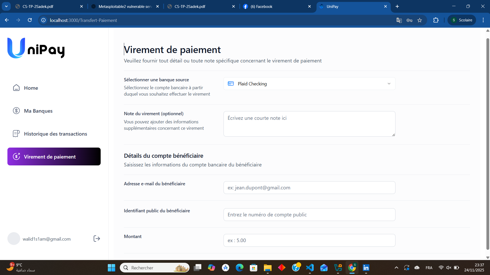
  
### Manager
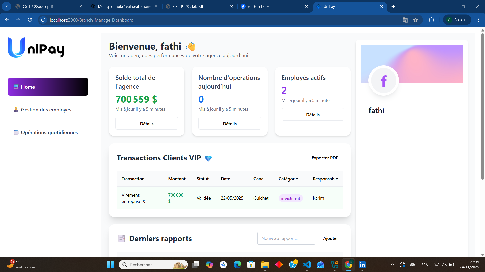
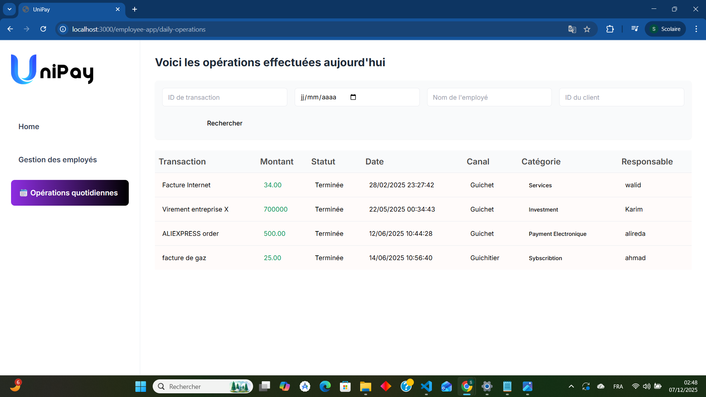
### 🔹 **Employee Interface**
- **Teller:** day‑to‑day banking operations
- **Manager:** supervision, branch overview & reports
- **Administrator:** employee management, roles & permissions
- ### AUTH
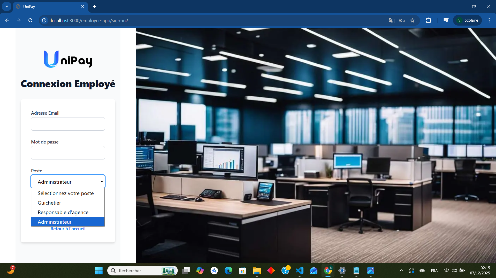
- ### Teller
- 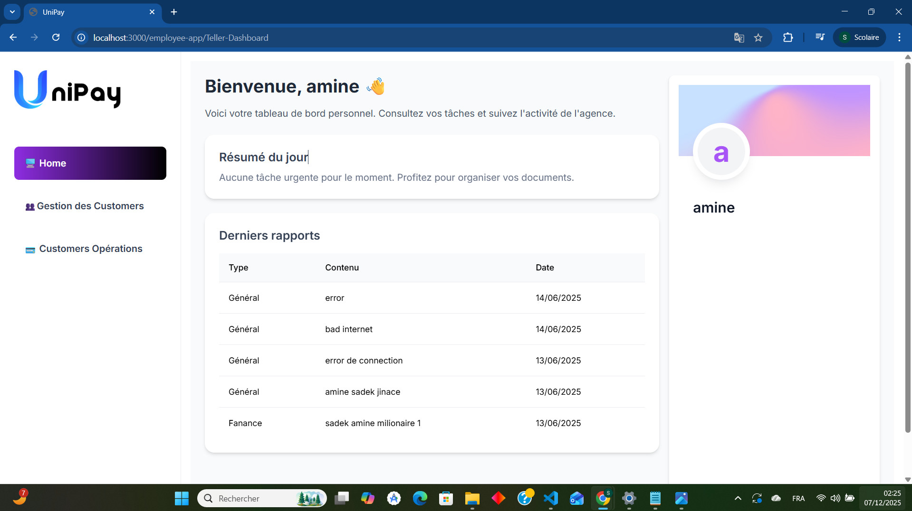
- 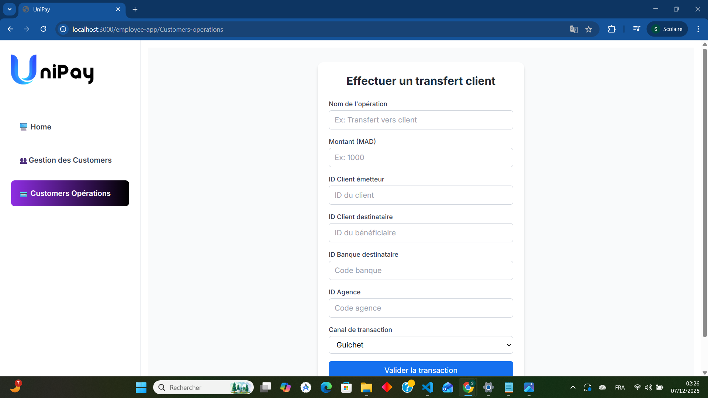
- 
 ### Administrator
-  
-  
-   !employee-appEmployees2](public/screenshots/employee-appEmployees2.png)

### 🔹 **Cross‑Functional Features**
- Secure authentication (encrypted server-side sessions)
- **RBAC** – Role‑Based Access Control
- Multi‑bank connectivity via **Dwolla**
- Modern UI using **Next.js 15** & **Tailwind CSS 4**

---

## 🧱 **Technical Architecture**
```
UniPay
│
├── Frontend
│   ├── Next.js 15
│   ├── React.js
│   ├── Tailwind CSS 4
│   └── Shadcn UI
│
├── Backend
│   ├── Appwrite (Auth, Database, Storage)
│   ├── Plaid API
│   └── Dwolla API
│
└── Database (Appwrite Collections)
    ├── APPWRITE_CLIENT
    ├── APPWRITE_TELLER
    ├── APPWRITE_EMPLOYEE
    ├── APPWRITE_MANAGER
    ├── APPWRITE_BRANCH
    ├── APPWRITE_TRANSACTIONS
    └── APPWRITE_REPORTS
```

---

## 📊 **UML Modeling**

| Diagram Type | Description |
|--------------|-------------|
| **Use Case** | Client, Teller, Manager, Admin interactions |
| **Sequence** | Login, Signup, Transfers, Transaction Flow |
| **Class**    | Users, Accounts, Transactions, Branches |

All diagrams are available in:
```
/docs/uml
```

---

## ⚙️ **API & Internal Modules**

### 🔐 **Authentication & Security**
| Service | Description |
|---------|-------------|
| **Auth Service** | Login, signup, account recovery |
| **RBAC** | Role-based permissions system |
| **Secure Sessions** | Encrypted HTTP-only cookies |

### 💰 **Financial Modules**
| Module | Description |
|--------|-------------|
| **Accounts Service** | Multi-account & balance management |
| **Transactions Service** | History, filtering, pagination |
| **Transfers Service** | Dwolla transfers & internal transfers |

### 🏢 **Operational Modules**
| Module | Description |
|--------|-------------|
| **Employee Service** | Employee creation, editing, disabling |
| **Permissions Service** | Role assignment & access control |
| **Reports Service** | Automatic report generation |

---

## 🚀 **Installation & Setup**

### 1️⃣ Clone the repository
```bash
git clone https://github.com/your-repo/unipay.git
cd unipay
```

### 2️⃣ Install dependencies
```bash
npm install
```

### 3️⃣ Add environment variables
Create a **.env.local** file:
```
NEXT_PUBLIC_APPWRITE_ENDPOINT=
NEXT_PUBLIC_APPWRITE_PROJECT=
APPWRITE_API_KEY=

PLAID_CLIENT_ID=
PLAID_SECRET=
PLAID_ENV=sandbox

DWOLLA_KEY=
DWOLLA_SECRET=
DWOLLA_ENV=sandbox
```

### 4️⃣ Start the project
```bash
npm run dev
```

---

## 🖼️ **Screenshots (to be added)**
Place your images inside:
```
/public/screenshots
```

| Description | File |
|-------------|------|
| Home Page | home.png |
| Client Dashboard | client-dashboard.png |
| Transactions | transactions.png |
| Transfers | transfer.png |
| Employee Dashboard | employee-dashboard.png |
| Admin Panel | admin-panel.png |

---

## 📌 **Additional Recommended Files**

### 🔸 UI / Design Files
Folder:
```
/docs/design/ui/
```
Examples:
- unipay-ui.pdf
- unipay-wireframes.fig

### 🔸 UML Diagrams
```
/docs/uml/
```

### 🔸 Technical Specifications
Folder:
```
/docs/specs/
```
Examples:
- database-schema.pdf
- api-specification.pdf

---

## 🧭 **Future Roadmap**
- Mobile App (React Native)
- QR Code Payments
- Smart Budgeting Module
- AI-powered spending insights
- Automated PDF / Excel Exports

---

## 🏷️ **License**
**Academic Project – 2024/2025**  لا تضيف اي شيئ فقط اجعله منضم
